# Scientific Archive — Image Asset Catalog

Verified: 2026-10-02.

Eight historical/scientific image records plus AI image and resource records. No standalone blank paper texture selected. LOC derivative is 385 × 640 and is not high resolution. NASA, Pexels and Apache 2.0 permissions are distinct from CC0. AI model specifications and external tools are identified separately from images.

All six preferred libraries were searched. Selected image rights are checked at the item level. Metadata licensing does not establish image licensing.

## 1. Albert Einstein during a lecture in Vienna

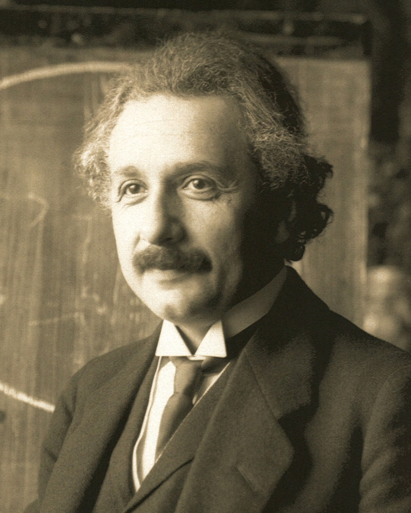

- **title**: Albert Einstein during a lecture in Vienna
- **source**: Wikimedia Commons; original photographer's work in Austrian National Library collections
- **source_page_url**: [https://commons.wikimedia.org/wiki/File:Einstein1921_by_F_Schmutzer_2.jpg](https://commons.wikimedia.org/wiki/File:Einstein1921_by_F_Schmutzer_2.jpg)
- **direct_image_url**: [https://upload.wikimedia.org/wikipedia/commons/a/af/Einstein1921_by_F_Schmutzer_2.jpg](https://upload.wikimedia.org/wikipedia/commons/a/af/Einstein1921_by_F_Schmutzer_2.jpg)
- **creator**: Ferdinand Schmutzer (1870–1928); digital cleanup by Quibik
- **year**: 1921
- **license**: Public Domain (PD-old; PD-US-unpublished; Public Domain Mark 1.0)
- **required_attribution**: None required by public-domain status; recommended: Ferdinand Schmutzer, 1921 / Wikimedia Commons
- **Resolution**: 1182 × 1475
- **Rights evidence**: Individual file page explicitly marks the photograph public domain in its country of origin and in the United States, explaining author death in 1928 and unpublished-work status. Not inferred from Commons collection licensing.
- **Local file**: einstein-1921.jpg
- **Placement**: Main website

## 2. Astrolabe of ‘Umar ibn Yusuf ibn ‘Umar ibn ‘Ali ibn Rasul al-Muzaffari

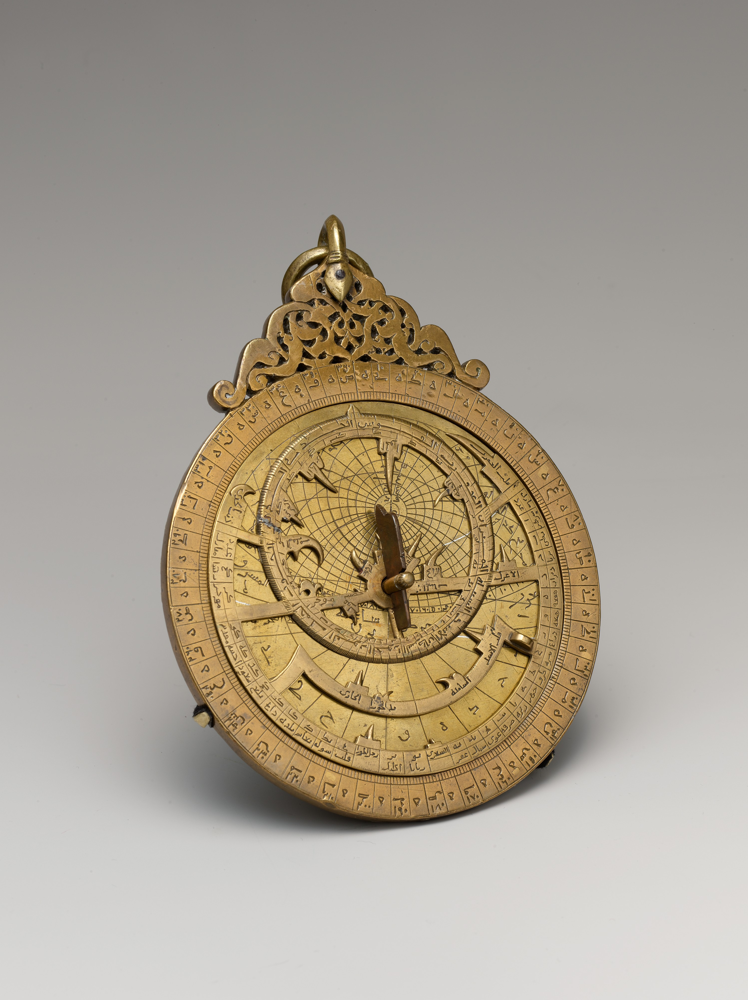

- **title**: Astrolabe of ‘Umar ibn Yusuf ibn ‘Umar ibn ‘Ali ibn Rasul al-Muzaffari
- **source**: The Metropolitan Museum of Art, Open Access
- **source_page_url**: [https://www.metmuseum.org/art/collection/search/444408](https://www.metmuseum.org/art/collection/search/444408)
- **direct_image_url**: [https://images.metmuseum.org/CRDImages/is/original/DP170386.jpg](https://images.metmuseum.org/CRDImages/is/original/DP170386.jpg)
- **creator**: ‘Umar ibn Yusuf ibn ‘Umar ibn ‘Ali ibn Rasul al-Muzaffari
- **year**: 690 AH / 1291 CE
- **license**: CC0 1.0 / Public Domain
- **required_attribution**: None required under CC0; recommended: The Metropolitan Museum of Art, Edward C. Moore Collection, Bequest of Edward C. Moore, 1891
- **Resolution**: 2995 × 4000
- **Rights evidence**: Individual object page labels this image Public Domain; object API isPublicDomain=true. The Met's Open Access policy releases public-domain collection images under CC0.
- **Local file**: met-astrolabe-1291-high.jpg
- **Placement**: Main website

## 3. Galileo Galilei letter to Nicolas Peiresc, 12 May 1635, page 1

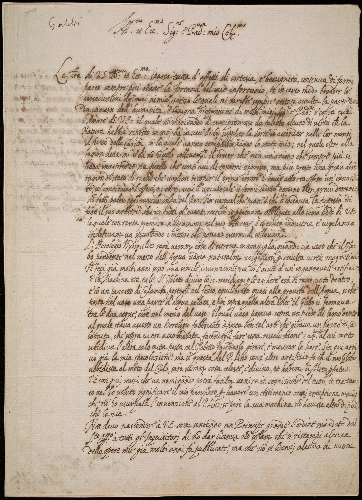

- **title**: Galileo Galilei letter to Nicolas Peiresc, 12 May 1635, page 1
- **source**: Smithsonian Libraries and Archives; Smithsonian digitization hosted at Internet Archive
- **source_page_url**: [https://library.si.edu/digital-library/book/letter00gali](https://library.si.edu/digital-library/book/letter00gali)
- **direct_image_url**: [https://iiif.archive.org/iiif/Letter00Gali$1/full/1600,/0/default.jpg](https://iiif.archive.org/iiif/Letter00Gali$1/full/1600,/0/default.jpg)
- **creator**: Galileo Galilei (1564–1642)
- **year**: 1635
- **license**: CC0 1.0 / Public Domain
- **required_attribution**: None required under CC0; recommended: Smithsonian Libraries and Archives, Dibner Library, MSS 562 A
- **Resolution**: 1600 × 2209
- **Rights evidence**: This exact Smithsonian digitized book page displays CC0 — Creative Commons (CC0 1.0) and explicitly states its content is in the public domain. IIIF image is page 1 of linked Internet Archive item Letter00Gali.
- **Local file**: smithsonian-galileo-letter-1635.jpg
- **Placement**: Main website

## 4. Andromeda — ultraviolet view from GALEX

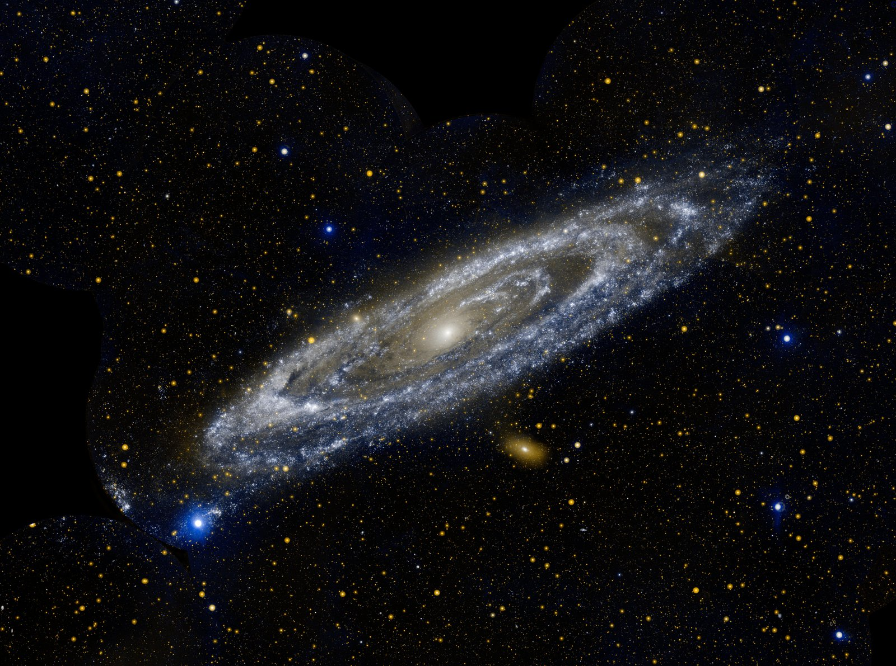

- **title**: Andromeda — ultraviolet view from GALEX
- **source**: NASA Jet Propulsion Laboratory, Photojournal PIA15416
- **source_page_url**: [https://www.jpl.nasa.gov/images/pia15416-andromeda/](https://www.jpl.nasa.gov/images/pia15416-andromeda/)
- **direct_image_url**: [https://d2pn8kiwq2w21t.cloudfront.net/images/jpegPIA15416.width-1600.jpg](https://d2pn8kiwq2w21t.cloudfront.net/images/jpegPIA15416.width-1600.jpg)
- **creator**: NASA/JPL-Caltech; Galaxy Evolution Explorer mission
- **year**: 2012 (released May 16)
- **license**: NASA/JPL image-use permission; NASA content generally not copyrighted in the United States; not labeled CC0
- **required_attribution**: NASA/JPL-Caltech
- **Resolution**: 1600 × 1191
- **Rights evidence**: Individual page credit is NASA/JPL-Caltech only, and contains no third-party copyright notice. JPL Image Use Policy permits any purpose unless otherwise noted, with credit and no implied endorsement. NASA media guidelines explicitly allow personal educational webpages.
- **Local file**: nasa-andromeda-1600.jpg
- **Placement**: Main website

## 5. Apollo 17: Blue Marble

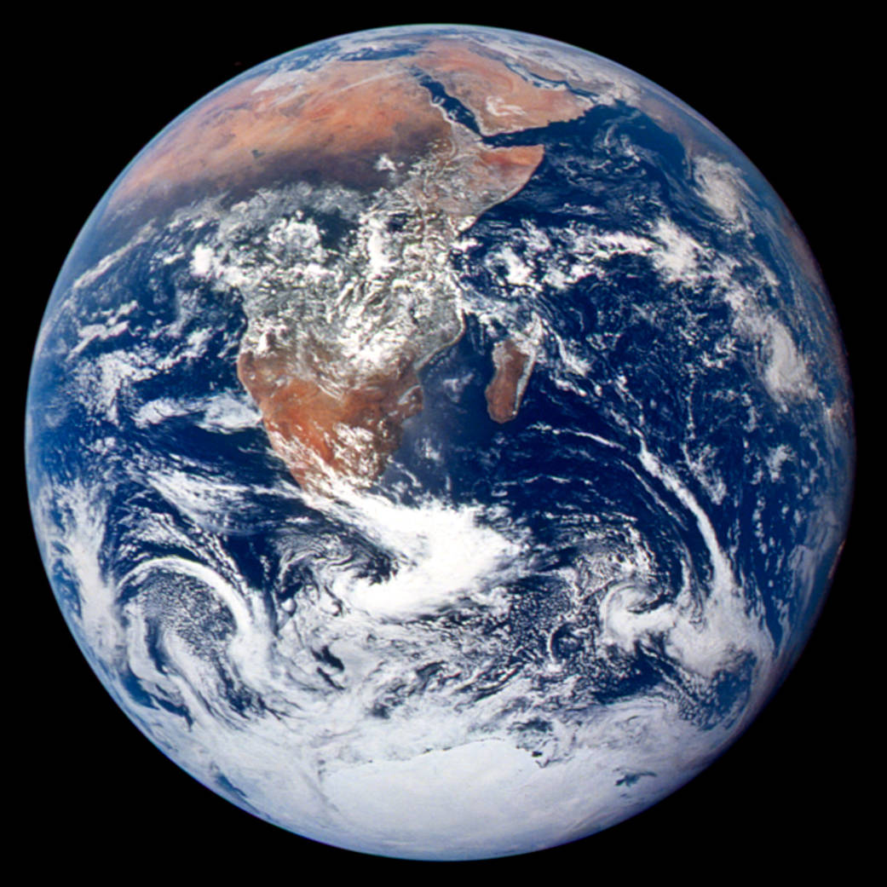

- **title**: Apollo 17: Blue Marble
- **source**: NASA
- **source_page_url**: [https://www.nasa.gov/image-article/apollo-17-blue-marble/](https://www.nasa.gov/image-article/apollo-17-blue-marble/)
- **direct_image_url**: [https://www.nasa.gov/wp-content/uploads/2023/03/as17-148-22727_lrg.jpg](https://www.nasa.gov/wp-content/uploads/2023/03/as17-148-22727_lrg.jpg)
- **creator**: NASA / Apollo 17 crew
- **year**: 1972
- **license**: Public Domain in the United States (NASA/U.S. Government work); NASA media-use guidelines
- **required_attribution**: NASA / Apollo 17 crew
- **Resolution**: 1041 × 1041
- **Rights evidence**: NASA's individual article identifies the image as taken by the Apollo 17 crew en route to the Moon; original NASA asset AS17-148-22727. No third-party copyright notice. NASA guidelines permit informational and personal webpages and request source acknowledgment.
- **Local file**: nasa-blue-marble.jpg
- **Placement**: Main website

## 6. Dialogo secondo. (page 140)

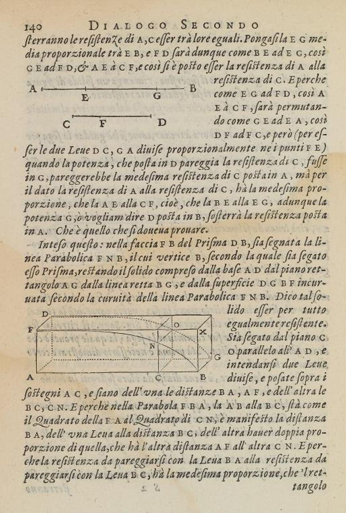

- **title**: Dialogo secondo. (page 140)
- **source**: The New York Public Library Digital Collections, Rare Book Division
- **source_page_url**: [https://old-digitalcollections.nypl.org/items/94a62628-8443-202e-e040-e00a1806743e](https://old-digitalcollections.nypl.org/items/94a62628-8443-202e-e040-e00a1806743e)
- **direct_image_url**: [https://iiif-prod.nypl.org/index.php?id=ps_rbk_cd14_212&t=q](https://iiif-prod.nypl.org/index.php?id=ps_rbk_cd14_212&t=q)
- **creator**: Galileo Galilei (1564–1642); published by Appresso gli Elsevirii
- **year**: 1638
- **license**: Public Domain under United States law; NYPL does not determine other-country status. Not CC0.
- **required_attribution**: None required by NYPL; suggested: From The New York Public Library, with link to item.
- **Resolution**: 1080 × 1600
- **Rights evidence**: Exact item page states Free to use without restriction and has an item-specific rights statement: NYPL believes this item is in the public domain under US law. Published 1638; creator died 1642. Item image ID ps_rbk_cd14_212. Not inferred from all NYPL holdings.
- **Local file**: nypl-galileo-mechanics-1638.jpg
- **Placement**: Additional catalog record

Provides authentic aged paper and margins; it is a printed page, not a separate blank texture asset.

## 7. Plate XXVII

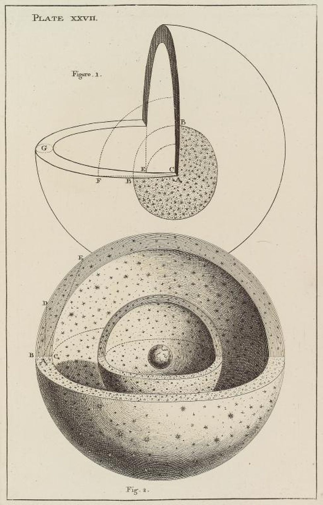

- **title**: Plate XXVII
- **source**: The New York Public Library Digital Collections, Spencer Collection
- **source_page_url**: [https://digitalcollections.nypl.org/items/8927c324-7920-93fa-e040-e00a18063ca9](https://digitalcollections.nypl.org/items/8927c324-7920-93fa-e040-e00a18063ca9)
- **direct_image_url**: [https://iiif-prod.nypl.org/index.php?id=ps_prn_cd23_335&t=q](https://iiif-prod.nypl.org/index.php?id=ps_prn_cd23_335&t=q)
- **creator**: Thomas Wright (1711–1786), author; engraver not identified in item record
- **year**: 1750
- **license**: Public Domain under United States law; NYPL does not determine other-country status. Not CC0.
- **required_attribution**: None required by NYPL; suggested: From The New York Public Library, with link to item.
- **Resolution**: 1025 × 1600
- **Rights evidence**: Exact item record gives item-specific public-domain rights statement, publication London 1750, collection An original theory or new hypothesis of the universe, author Thomas Wright. Item image ID ps_prn_cd23_335. Not inferred from all NYPL holdings.
- **Local file**: nypl-wright-universe-1750-high.jpg
- **Placement**: Additional catalog record

Provides authentic archival paper and margins; it is a printed engraving, not a separate blank texture asset.

## 8. New Jersey—The wizard of electricity—Thomas A. Edison's system of electric illumination

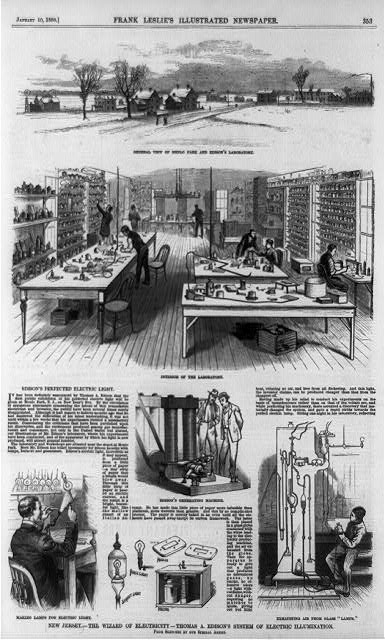

- **title**: New Jersey—The wizard of electricity—Thomas A. Edison's system of electric illumination
- **source**: Library of Congress, Prints and Photographs Division; Free to Use and Reuse, Scientists & Inventors
- **source_page_url**: [https://www.loc.gov/item/89714482/](https://www.loc.gov/item/89714482/)
- **direct_image_url**: [https://cdn.loc.gov/service/pnp/cph/3b40000/3b44000/3b44000/3b44049r.jpg](https://cdn.loc.gov/service/pnp/cph/3b40000/3b44000/3b44000/3b44049r.jpg)
- **creator**: Artist/engraver not identified in Library of Congress item record; publisher Frank Leslie's Illustrated Newspaper
- **year**: 1880
- **license**: Public Domain in the United States: published in the US in 1880. Not CC0.
- **required_attribution**: No copyright attribution requirement; recommended: Library of Congress, Prints and Photographs Division, LC-USZ62-97960.
- **Resolution**: 385 × 640
- **Rights evidence**: Individual LOC record identifies this as the wood engraving published in Frank Leslie's Illustrated Newspaper, 10 January 1880, page 353. Its US public-domain conclusion is based on that specific publication date, not merely the record's No known restrictions advisory. The exact image is also linked by LOC's curated Free to Use and Reuse Scientists & Inventors set as Laboratory of inventor Thomas Edison, 1880.
- **Local file**: loc-edison-electric-laboratory-1880.jpg
- **Placement**: Additional catalog record

Official public JPEG is a small derivative. Main website assets remain higher-resolution. Not upscaled.

## 9. Neural Network.svg

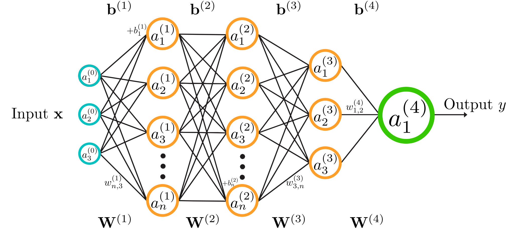

- **title**: Neural Network.svg
- **source**: Wikimedia Commons
- **source_page_url**: [https://commons.wikimedia.org/wiki/File:Neural_Network.svg](https://commons.wikimedia.org/wiki/File:Neural_Network.svg)
- **direct_image_url**: [https://upload.wikimedia.org/wikipedia/commons/1/15/Neural_Network.svg](https://upload.wikimedia.org/wikipedia/commons/1/15/Neural_Network.svg)
- **creator**: QuantuMechaniX8
- **year**: 2025
- **license**: CC0 1.0 Universal Public Domain Dedication
- **required_attribution**: None required. Optional credit: QuantuMechaniX8 / Wikimedia Commons, CC0.
- **Resolution**: 2457 × 1134
- **Rights evidence**: The individual file page identifies own work and explicitly states the copyright holder releases this file under CC0 1.0; not inferred from Commons collection rights.
- **Local file**: ai-neural-network.svg
- **Placement**: Main website

## 10. Atlas frontview 2013.jpg

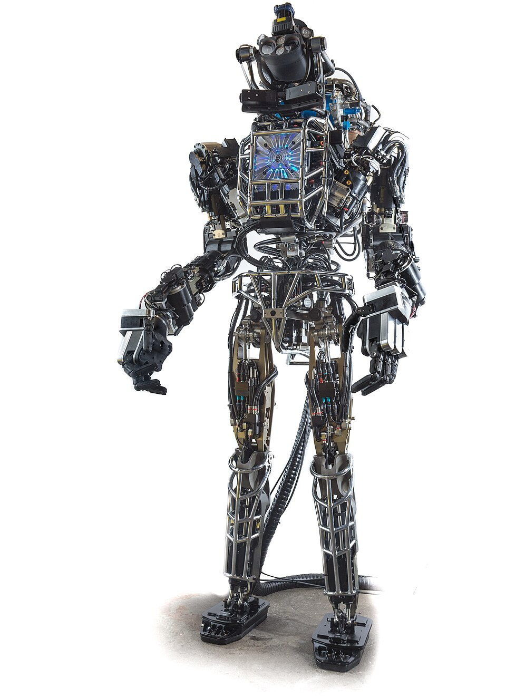

- **title**: Atlas frontview 2013.jpg
- **source**: Wikimedia Commons; original DARPA Robotics Challenge photograph
- **source_page_url**: [https://commons.wikimedia.org/wiki/File:Atlas_frontview_2013.jpg](https://commons.wikimedia.org/wiki/File:Atlas_frontview_2013.jpg)
- **direct_image_url**: [https://thumb.wikimedia.org/wikipedia/commons/thumb/8/81/Atlas_frontview_2013.jpg/960px-Atlas_frontview_2013.jpg](https://thumb.wikimedia.org/wikipedia/commons/thumb/8/81/Atlas_frontview_2013.jpg/960px-Atlas_frontview_2013.jpg)
- **creator**: DARPA
- **year**: 2013
- **license**: Public domain in the United States; US federal government work (PD-US-DARPA)
- **required_attribution**: Copyright attribution not required; DARPA requests appropriate photo credits. Use: Photo: DARPA, via Wikimedia Commons.
- **Resolution**: 960 × 1322
- **Rights evidence**: The individual file page attributes the photograph to DARPA and marks it PD-US-DARPA, with a specific official-duty government-work rationale. It also notes this image had public-domain confirmation. Logos/trademarks do not gain reuse rights from the copyright status.
- **Local file**: ai-atlas-2013.jpg
- **Placement**: Main website

## 11. Close-Up Photo of a Robot Arm

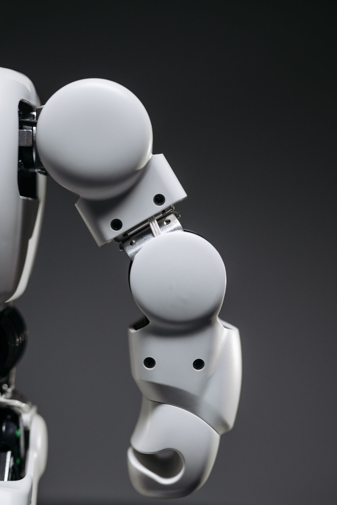

- **title**: Close-Up Photo of a Robot Arm
- **source**: Pexels
- **source_page_url**: [https://www.pexels.com/photo/close-up-photo-of-a-robot-arm-8294559/](https://www.pexels.com/photo/close-up-photo-of-a-robot-arm-8294559/)
- **direct_image_url**: [https://images.pexels.com/photos/8294559/pexels-photo-8294559.jpeg?auto=compress&cs=tinysrgb&w=1200](https://images.pexels.com/photos/8294559/pexels-photo-8294559.jpeg?auto=compress&cs=tinysrgb&w=1200)
- **creator**: Pavel Danilyuk
- **year**: 2021
- **license**: Pexels License (free website use; not CC0)
- **required_attribution**: Not required. Optional credit: Photo by Pavel Danilyuk on Pexels.
- **Resolution**: 1200 × 1797
- **Rights evidence**: The specific photo page identifies Pavel Danilyuk, a Nikon Z 5 camera, the date taken, and License: Free linked to the official Pexels License. That license expressly permits free website use and modification without attribution; it forbids implied endorsement and stock-platform redistribution.
- **Local file**: ai-robot-arm-pexels.jpg
- **Placement**: Main website

## 12. Franka Emika Panda — MuJoCo Menagerie simulation render

- **title**: Franka Emika Panda — MuJoCo Menagerie simulation render
- **source**: Google DeepMind / MuJoCo Menagerie
- **source_page_url**: [https://github.com/google-deepmind/mujoco_menagerie/tree/main/franka_emika_panda](https://github.com/google-deepmind/mujoco_menagerie/tree/main/franka_emika_panda)
- **direct_image_url**: [https://raw.githubusercontent.com/google-deepmind/mujoco_menagerie/main/franka_emika_panda/panda.png](https://raw.githubusercontent.com/google-deepmind/mujoco_menagerie/main/franka_emika_panda/panda.png)
- **creator**: MuJoCo Menagerie contributors; robot description derived from Franka Emika
- **year**: Not separately stated for this render; project citation is 2022
- **license**: Apache License 2.0
- **required_attribution**: Retain Apache 2.0 license and applicable copyright/attribution notices when distributing. Suggested site credit: MuJoCo Menagerie / Google DeepMind, Apache 2.0. Mark any modifications.
- **Resolution**: 3840 × 2160
- **Rights evidence**: Panda-specific README explicitly licenses this model Apache 2.0 and links to its own LICENSE. The repository separately explains that per-model XML/assets may have different licenses, while other content (including this repository render) is Apache 2.0. Both per-model and root license files saved locally.
- **Local file**: ai-mujoco-panda.png
- **Placement**: Main website

[Local license text](licenses/mujoco-panda-LICENSE.txt)

## 13. Franka Emika Panda Description (MJCF)

- **title**: Franka Emika Panda Description (MJCF)
- **source**: Google DeepMind / MuJoCo Menagerie
- **source_page_url**: [https://github.com/google-deepmind/mujoco_menagerie/tree/4d038b3feae26ec82b46a4d586379114012a8ac7/franka_emika_panda](https://github.com/google-deepmind/mujoco_menagerie/tree/4d038b3feae26ec82b46a4d586379114012a8ac7/franka_emika_panda)
- **direct_image_url**: [https://raw.githubusercontent.com/google-deepmind/mujoco_menagerie/main/franka_emika_panda/panda.png](https://raw.githubusercontent.com/google-deepmind/mujoco_menagerie/main/franka_emika_panda/panda.png)
- **creator**: MuJoCo Menagerie contributors; derived from Franka Emika franka_ros URDF and meshes
- **year**: Not separately asserted; Menagerie project citation is 2022
- **license**: Apache License 2.0 — verified model-specific license
- **required_attribution**: Distribute the Apache 2.0 license, retain applicable notices, and mark changes. Suggested scientific credit: MuJoCo Menagerie, Kevin Zakka, Yuval Tassa and contributors (2022). Robot/model marks carry no endorsement.
- **Resolution**: Not an image
- **Rights evidence**: The model-specific README says this model is Apache-2.0 and links franka_emika_panda/LICENSE. The README identifies URDF/mesh provenance and conversion steps. This is independent verification of this model, not an inference from the repository root license.
- **Local file**: models/panda-model.zip
- **Placement**: Main website

[Local license text](licenses/mujoco-panda-LICENSE.txt)

Complete franka_emika_panda directory saved and ZIP packaged at a pinned repository commit. Contains 80 files, including all 9 XML files, meshes, render, README, changelog and model LICENSE. All 271 XML file references resolve to existing local files. Runtime simulation not tested; no embedded 3D viewer claimed. README requires MuJoCo 2.3.3 or later.

## 14. A Neural Network Playground

- **title**: A Neural Network Playground
- **source**: TensorFlow Playground / Google
- **source_page_url**: [https://playground.tensorflow.org/](https://playground.tensorflow.org/)
- **direct_image_url**: Not available
- **creator**: Daniel Smilkov and Shan Carter
- **year**: Not stated on the cited hosted page
- **license**: Underlying open-source project: Apache License 2.0; catalog contains a link only
- **required_attribution**: No copied UI screenshot or code included. For future code reuse, retain Apache 2.0 license and notices. Suggested link credit: TensorFlow Playground, Daniel Smilkov and Shan Carter.
- **Resolution**: Not an image
- **Rights evidence**: Hosted page names both creators and explicitly links its source code and Apache license; the linked tensorflow/playground/LICENSE was inspected and saved. This record does not assign a blanket public-domain license to screenshots or third-party content.
- **Local file**: External resource only
- **Placement**: Main website

[Local license text](licenses/tensorflow-playground-LICENSE.txt)

Link as a learning resource. No hosted UI screenshot copied.

## Excluded records

- **Galileo manuscript.png**: Commons description identifies this image as a 1930s forgery recognized in 2022; not authentic Galileo manuscript.
- **General Radio / Cambridge Instrument / Queen galvanometer photos at Smithsonian**: Individual item pages say Usage Conditions Apply and restrictions for image reuse. Metadata Usage CC0 applies to metadata only, so images were excluded.
- **NewtonsPrincipia.jpg**: Item has CC0 text but lacks source information and contains conflicting structured license fields; replaced by well-sourced Smithsonian CC0 Galileo letter.

## Coverage

3 supplemental records cover historical laboratory views, electrical apparatus, astronomy engraving, mathematical diagrams, physics illustrations, and sources of archival paper texture. No independent blank archival-paper texture was selected. Main website assets remain unchanged.
